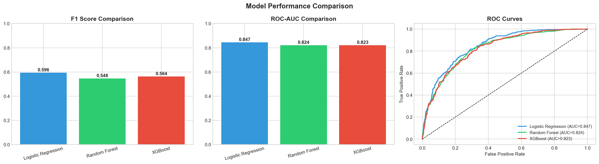

# Customer Churn Prediction
Predicting telecom customer churn using Machine Learning.

## Results
| Model | F1 Score | ROC-AUC |
|-------|----------|---------|
| Logistic Regression | 0.5961 | 0.8468 |
| Random Forest | 0.5479 | 0.8237 |
| XGBoost | 0.5644 | 0.8232 |

## Key Findings
- Month-to-month customers churn 3x more
- Shorter tenure = higher risk
- More services = less churn

## Tools Used
Python, Pandas, Scikit-learn, XGBoost, Matplotlib, Seaborn

